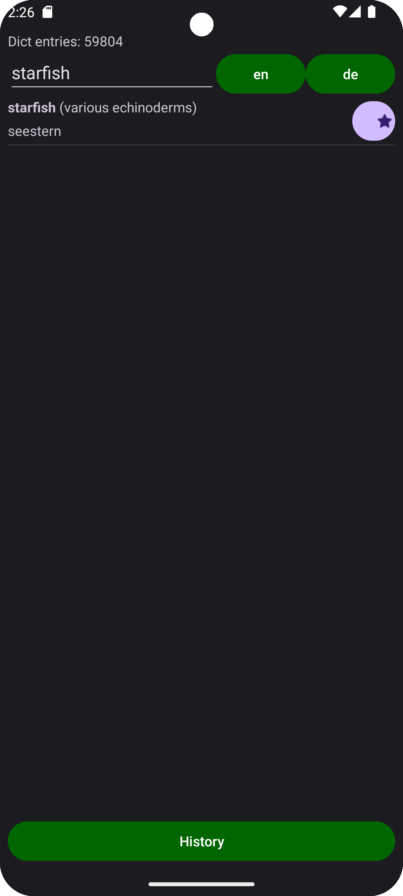
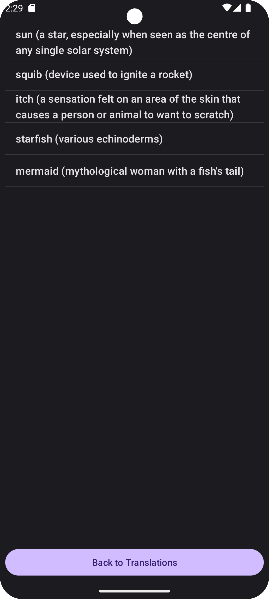

# MyAndroidDictionary

1. translates en-de from locally stored open source dictionary
2. allows to store searches in a history

<table>
<tr>
    <td>
        
        Main Activity
    </td>
    <td>
        
        HistoryActivity
    </td>
</tr>
</table>

## @future

search using deepl if no matches are found local dict doesn't 
